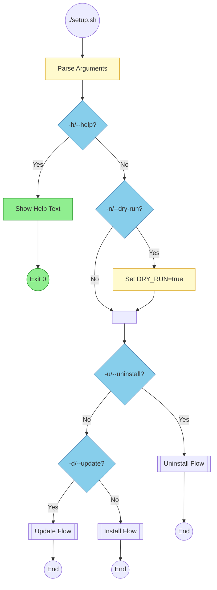
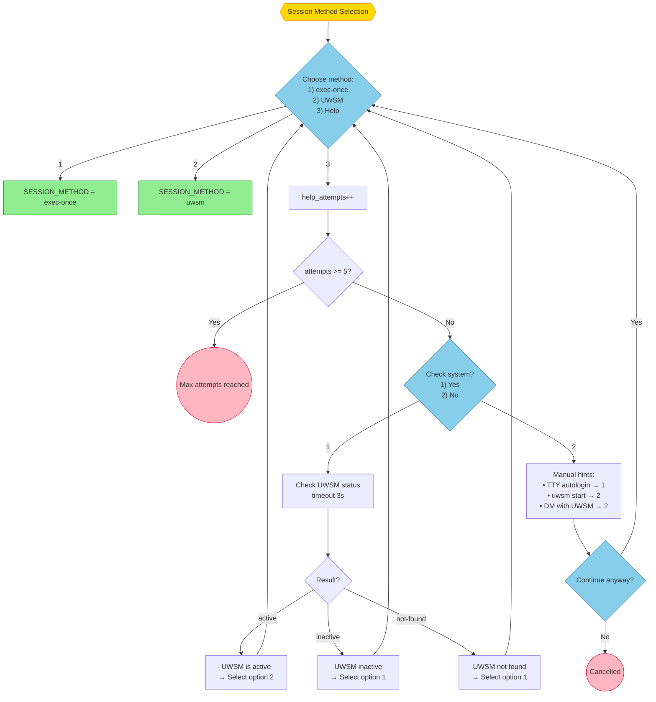
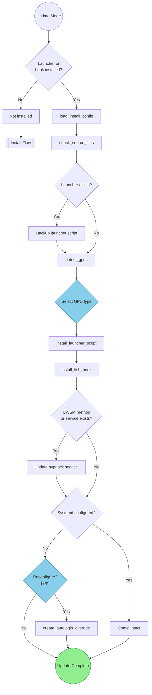

# hypr-login Setup User Journey Flowchart

Visual representation of all paths through `setup.sh`.

> **Rendering**: These diagrams use [Mermaid](https://mermaid.js.org/) syntax and render automatically in GitHub, VS Code (with Mermaid extension), and most markdown viewers.

## Color Legend

| Color | Meaning |
|-------|---------|
| Green | Success/completion |
| Red/Pink | Failure/error |
| Blue | User prompt/decision |
| Yellow | Process step |
| Gold | Critical confirmation |

---

## Diagram 1: Entry Point Router

Shows all 5 entry points and how arguments are parsed.



---

## Diagram 2: Install Mode - Overview

The 10 phases of the installation journey.

```mermaid
flowchart TD
    classDef success fill:#90EE90,stroke:#228B22
    classDef failure fill:#FFB6C1,stroke:#DC143C
    classDef prompt fill:#87CEEB,stroke:#4682B4
    classDef process fill:#FFFACD,stroke:#DAA520
    classDef critical fill:#FFD700,stroke:#FF8C00

    START(("Install Mode"))

    subgraph P1 [Phase 1: Welcome]
        P1_BANNER[Show Warning Banner]
        P1_CONTINUE{"Continue?<br/>[Y/n]"}:::prompt
    end

    subgraph P2 [Phase 2: Pre-flight]
        P2_DEPS[check_dependencies]
        P2_SRC[check_source_files]
        P2_INSTALLED{Already installed?}
    end

    subgraph P3 [Phase 3: Detection]
        P3_AUTO[Auto-detect:<br/>username, GPU, DRM, configs]
        P3_HYPRLOCK[detect_hyprlock_in_config]
    end

    subgraph P4 [Phase 4: Confirm]
        P4_USER{"Use username?"}:::prompt
        P4_GPU{"Select GPU"}:::prompt
        P4_DRM{"Select display"}:::prompt
        P4_SESSION{"Session method?<br/>1=exec-once<br/>2=UWSM<br/>3=Help"}:::prompt
    end

    subgraph P5 [Phase 5: Summary]
        P5_SHOW[show_detection_summary]
        P5_CONFIRM{"Proceed?<br/>[Y/n]"}:::prompt
    end

    subgraph P6 [Phase 6: Save]
        P6_SAVE[save_install_config]
    end

    subgraph P7 [Phase 7: User Install]
        P7_LAUNCHER[install_launcher_script]
        P7_HOOK[install_fish_hook]
        P7_BRANCH{SESSION_METHOD?}
        P7_UWSM[install_hyprlock_service]
        P7_EXEC[show_execs_instructions]
    end

    subgraph P8 [Phase 8: System Install]
        P8_SUDO{"Proceed with sudo?"}:::prompt
        P8_OVERRIDE[create_autologin_override]
    end

    subgraph P9 [Phase 9: Testing]
        P9_TTY2[setup_tty2_testing]
        P9_TEST{"Test passed?"}:::prompt
    end

    subgraph P10 [Phase 10: SDDM Cutover]
        P10_DISABLE{{"Type 'yes' to<br/>disable SDDM"}}:::critical
        P10_REBOOT{"Reboot now?"}:::prompt
    end

    EXIT_CANCEL(("Cancelled")):::failure
    EXIT_FAIL(("Error")):::failure
    EXIT_PARTIAL(("Partial")):::failure
    EXIT_SUCCESS(("Success")):::success

    START --> P1_BANNER --> P1_CONTINUE
    P1_CONTINUE -->|No| EXIT_CANCEL
    P1_CONTINUE -->|Yes| P2_DEPS

    P2_DEPS --> P2_SRC --> P2_INSTALLED
    P2_INSTALLED -->|No| P3_AUTO

    P3_AUTO --> P3_HYPRLOCK --> P4_USER
    P4_USER --> P4_GPU --> P4_DRM --> P4_SESSION
    P4_SESSION --> P5_SHOW --> P5_CONFIRM

    P5_CONFIRM -->|No| EXIT_CANCEL
    P5_CONFIRM -->|Yes| P6_SAVE

    P6_SAVE --> P7_LAUNCHER --> P7_HOOK --> P7_BRANCH
    P7_BRANCH -->|UWSM| P7_UWSM --> P8_SUDO
    P7_BRANCH -->|exec-once| P7_EXEC --> P8_SUDO

    P8_SUDO -->|No| EXIT_PARTIAL
    P8_SUDO -->|Yes| P8_OVERRIDE --> P9_TTY2

    P9_TTY2 --> P9_TEST
    P9_TEST -->|No| EXIT_PARTIAL
    P9_TEST -->|Yes| P10_DISABLE

    P10_DISABLE -->|Not 'yes'| EXIT_PARTIAL
    P10_DISABLE -->|'yes'| P10_REBOOT

    P10_REBOOT --> EXIT_SUCCESS
```



---

## Diagram 3: Session Method Decision Tree

Critical branching point for choosing exec-once vs UWSM.



---

## Diagram 4: Update Mode Flow

Simpler flow for updating an existing installation.



---

## Diagram 5: Uninstall Mode Flow

Complete removal of hypr-login components.

```mermaid
flowchart TD
    classDef success fill:#90EE90,stroke:#228B22
    classDef failure fill:#FFB6C1,stroke:#DC143C
    classDef prompt fill:#87CEEB,stroke:#4682B4

    START(("Uninstall Mode"))

    LOAD_CONFIG[Load install config]
    DETECT_UWSM{UWSM install<br/>detected?}
    SET_UWSM["was_uwsm = true"]

    CONFIRM{"Remove all?<br/>[Y/n]"}:::prompt
    CANCEL(("Cancelled")):::failure

    REMOVE_LAUNCHER[Remove launcher script]
    REMOVE_HOOK[Remove fish hook]

    CHECK_UWSM2{was_uwsm?}
    REMOVE_SVC[Remove hyprlock service]

    REMOVE_CONFIG[Remove install config]

    CHECK_OVERRIDE{Systemd override exists?}
    OFFER_REMOVE{"Remove override?<br/>[Y/n]"}:::prompt
    DO_REMOVE[sudo rm override]

    MANUAL_STEPS["Show manual steps"]

    OFFER_SDDM{"Enable SDDM?<br/>[Y/n]"}:::prompt
    DO_ENABLE[sudo systemctl enable sddm]

    SUCCESS["Uninstall complete"]:::success
    OFFER_REBOOT{"Reboot now?<br/>[Y/n]"}:::prompt
    REBOOT(("Rebooting...")):::success
    DONE(("Done")):::success

    START --> LOAD_CONFIG --> DETECT_UWSM
    DETECT_UWSM -->|Yes| SET_UWSM --> CONFIRM
    DETECT_UWSM -->|No| CONFIRM

    CONFIRM -->|No| CANCEL
    CONFIRM -->|Yes| REMOVE_LAUNCHER --> REMOVE_HOOK --> CHECK_UWSM2

    CHECK_UWSM2 -->|Yes| REMOVE_SVC --> REMOVE_CONFIG
    CHECK_UWSM2 -->|No| REMOVE_CONFIG

    REMOVE_CONFIG --> CHECK_OVERRIDE
    CHECK_OVERRIDE -->|No| MANUAL_STEPS
    CHECK_OVERRIDE -->|Yes| OFFER_REMOVE
    OFFER_REMOVE -->|No| MANUAL_STEPS
    OFFER_REMOVE -->|Yes| DO_REMOVE --> MANUAL_STEPS

    MANUAL_STEPS --> OFFER_SDDM
    OFFER_SDDM -->|No| SUCCESS
    OFFER_SDDM -->|Yes| DO_ENABLE --> SUCCESS

    SUCCESS --> OFFER_REBOOT
    OFFER_REBOOT -->|Yes| REBOOT
    OFFER_REBOOT -->|No| DONE
```



---

## Quick Reference

### Exit Codes

| Exit Type | When | SDDM Status |
|-----------|------|-------------|
| Success | Full install complete | Disabled |
| Partial (sudo) | User declined sudo | Enabled |
| Partial (test) | Test failed, user exited | Enabled |
| Partial (SDDM) | User didn't type 'yes' | Enabled |
| Cancelled | User said 'No' to continue | Unchanged |
| Error | Missing deps/sources | Unchanged |

### Files Installed

| Mode | Files Created |
|------|---------------|
| exec-once | `~/.config/hypr/scripts/hyprland-tty.fish`<br/>`~/.config/fish/conf.d/hyprland-autostart.fish`<br/>`/etc/systemd/.../autologin.conf`<br/>`~/.config/hypr-login/install.conf` |
| UWSM | Above + `~/.config/systemd/user/hyprlock.service` |

### Recovery Commands

```bash
# From tty3
sudo systemctl enable sddm && sudo reboot

# From Live USB
arch-chroot /mnt systemctl enable sddm
```

---

## Session Method Comparison

| Aspect | exec-once | UWSM |
|--------|-----------|------|
| Hyprlock start | Manual config line | Systemd service |
| Config needed | `exec-once = hyprlock` | None |
| Service file | None | `~/.config/systemd/user/hyprlock.service` |
| Detection | Check execs*.conf | Check systemd service |
| Update behavior | Re-read config | Restart service |
